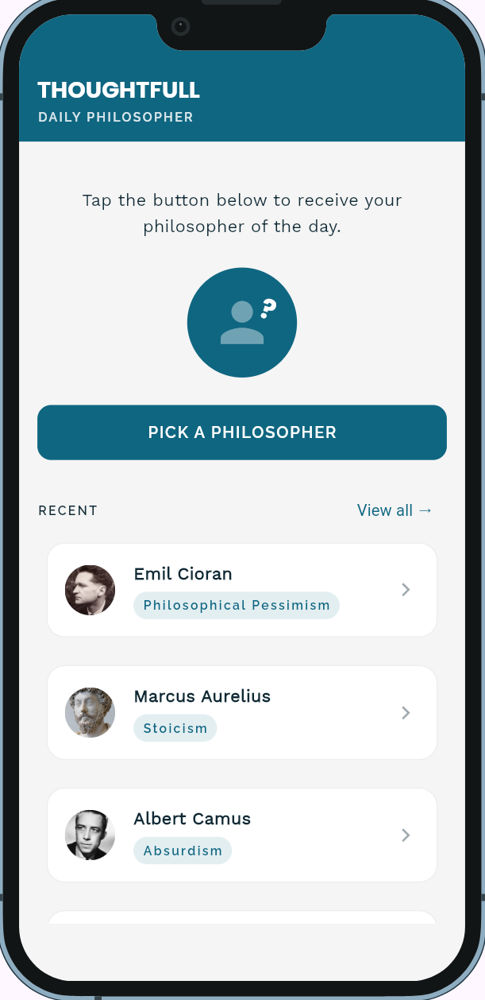
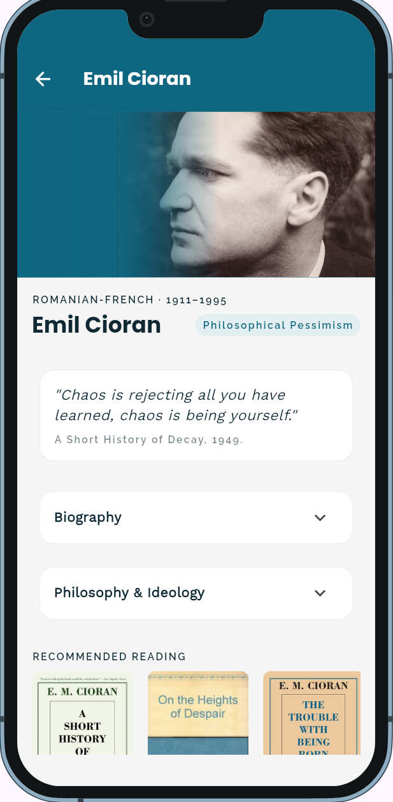
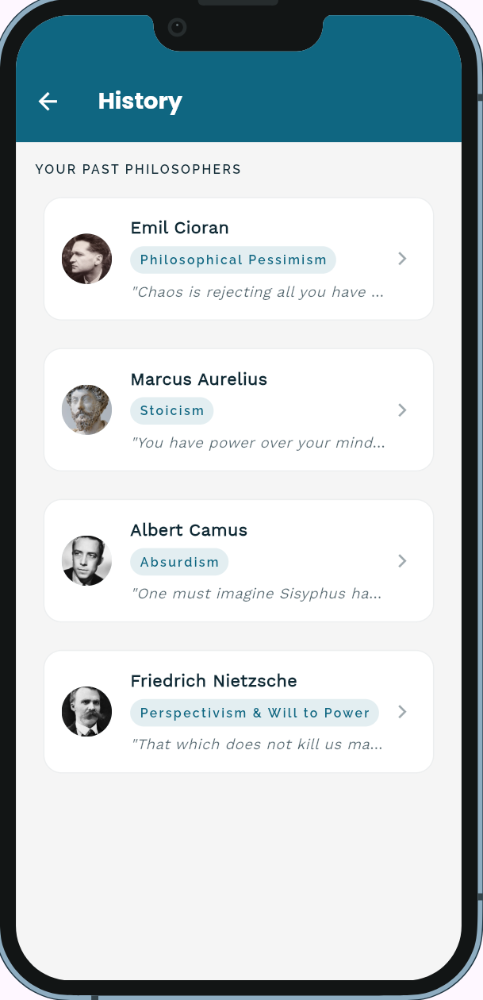

[](AI-USAGE.md)
# ThoughtFull

> A randomly picked philosopher, their ideology, a quote, biography, and book
recommendations — one thinker at a time.


**Live demo:** https://wozuwozu.github.io/ThoughtFull/ <!-- GitHub Pages is set up already; replace if you host elsewhere -->
**Demo video:** `docs/demo.mp4` (link it here once it exists)
**Course:** Applications Development and Emerging Technologies (6ADET), Holy Angel University
**Author:** WozuWozu

This repository lives in the author's own GitHub account and is public on
purpose. There is no `student.json` here and there should not be one: see
`docs/06-security-and-privacy.md` for what a public repo means for secrets and
personal data.

---

## Screenshots


| Dashboard | Philosopher Screen | History | 
| --- | --- | --- |
|  |  |  |

## What it does

- Roll a randomized philosopher from the pool
- View philosopher's bio, philosophy as well as book recommendations on them
- View their history or four recently rolled philosophers

## Built with

| | |
| --- | --- |
| Framework | Flutter (Dart) |
| State | `setState` (StatefulWidget) |
| Storage | shared_preferences - history of rolled philosophers, stored locally as a List<String> of IDs|
| Other packages | `google_fonts` (Poppins/Work Sans/Raleway typography, per the design system) |

## Running it yourself

```bash
flutter pub get
flutter run -d web-server --web-port 8080
```

Then open http://localhost:8080. Requires Flutter 3.47.4 / Dart 3.13.3 or later
(run `flutter --version` to check yours).

### Environment variables

The project is local so environmental variables do not apply,
which is why the table in this section has been removed. All of it
is N/A

## Privacy and secrets

Required section. Two or three honest sentences:

The app stores no personal data. The only thing saved locally is a 
small list of philosopher IDs that the user has already seen via the
'shared_preferences' - no data leaves the device, there is no account system,
and no network calls. All philosopher content (bios, quotes, book recommendations)
are all static bundled content and not user input.

There are no API keys or secrets that are required for the app to run, so there 
are no '.env' configurations. All sample content screenshots and demo video contain
no real personal information.

## Project documentation

| Document | |
| --- | --- |
| [Proposal](docs/01-proposal.md) | the problem, the users, the scope |
| [Mockup and wireframes](docs/02-mockup.md) | what it looks like, and the screen flow |
| [Design system](docs/03-design-system.md) | colors, type, spacing, components |
| [Weekly reports](docs/04-weekly-reports.md) | what happened each week |
| [Demo video](docs/05-demo-video.md) | the recording and what it shows |
| [Start here](START-HERE.md) | how this repo works (delete once you have read it) |
| [Security and privacy](docs/06-security-and-privacy.md) | the checklist, filled in |

## Status and what is next

Be honest. What works, what is half done, what you would build next. An honest
"known issues" section reads better than a claim the reader disproves in thirty
seconds.

The app is functional with the randomized philosophers, history and philosopher card screens.
Randomized quotes is most likely the biggest update in store, should there be time for it.
The current pool is 10 philosophers at the moment and will only increase after the quote
randomization is finalized. At the moment there are no known current issues in the app considering it's
scope is kept fairly small.

## Credits

- Packages: see `pubspec.yaml`
- Philosopher Portraits: Sourced from Wikimedia Commons (public domain/
CC-licensed where specified, individual file pages for licenses.)
- Old book cover Images: were also sourced from Wikimedia Commons
- Book cover images: sourced from Goodreads and similar sites. These are publisher
cover art and are **not** independently licensed for reuse by me, these were included here
for a non-commercial project to illustrate book recommendations , not claimed as original
or freely licensed work.

- tjakoen (instructor): giving project directives and suggestions throughout development

## AI use

The project was built with a substantial amount of assistance from Claude AI (Anthropic)
which was used for debugging, UI/layout iterations, explanation of code as well as 
support in documentation throughout development. See [AI-USAGE.md](AI-USAGE.md) for the breakdown,
of what was asked for, changes made as well as concepts kept.

## Licence

MIT, see [LICENSE](LICENSE).
