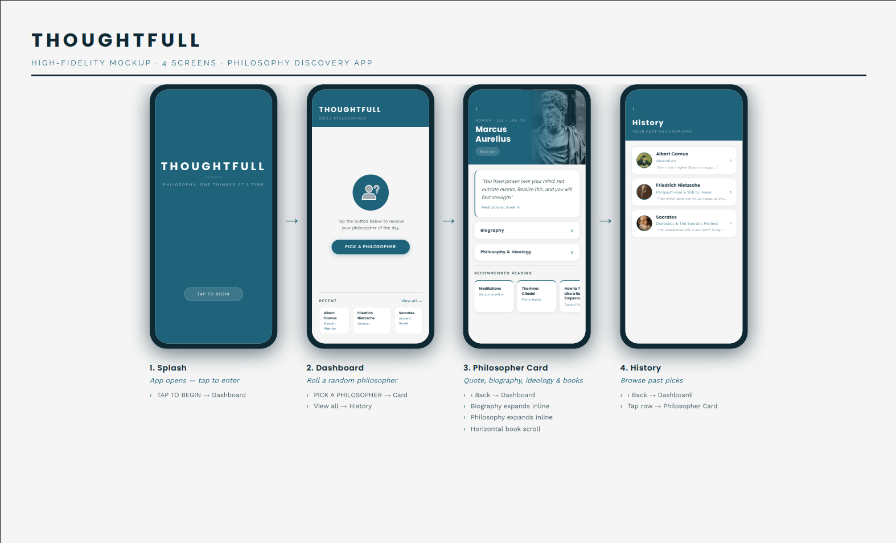
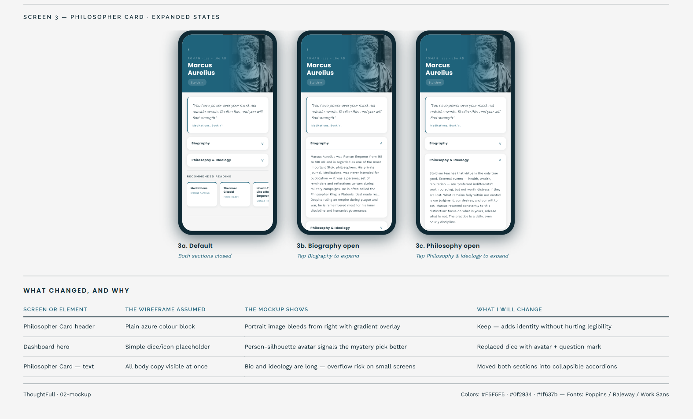
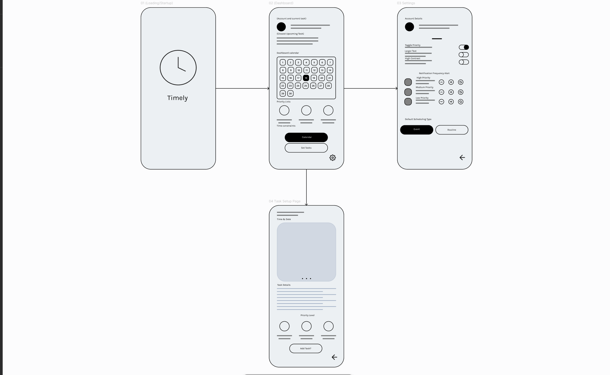
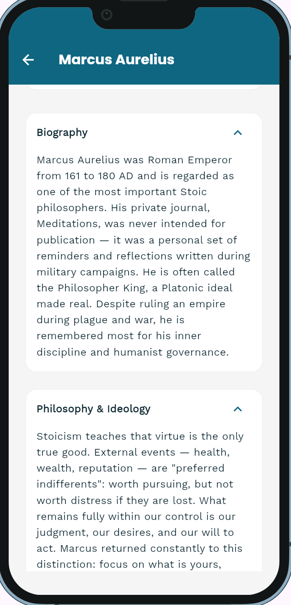

# Mockup and wireframes

The visual plan for this app. Your wireframes answered what goes where; the
mockup shows what it looks like.

## Mockup

Mockup Link: [Mockup PDF](assets/thoughtfull-mockup.pdf)
### Page 1

### Page 2

Put your mockup images or PDF in `assets/` and embed them here, one heading per
screen.

_(Embed your mockup here once it is in `assets/`.)_

## Wireframes

Disclaimer: The wireframe here was from the prototype app with a completely different concept from ThoughtFull,
ThoughtFull itself skipped the wireframe stage and went directly to mockup since it was simpler than the previous
app. Timely was scrapped due to it's scope being far too demanding and beyond my skill level

We didn't do flow diagrams and the sketch counted as the wireframe

## Screens

### Splash-Screen

Just a quick splash screen on app bootup, click to move to the next screen.

### Dashboard

Dashboard has the roll philosopher button and showcases the recent/history tab,
you can move into the history tab through recent button and the philosopher screen
through either a recent philosopher or a random new one.

### Philosopher Screen

Philosopher Screen allows you to click on a drop down to view the bio of a philosopher and their
ideology. It also has book recommendations at the bottom.

### History Screen

History Screen here is for viewing the four previously rolled philosophers,
click on their row to view to view their philosopher screen.

